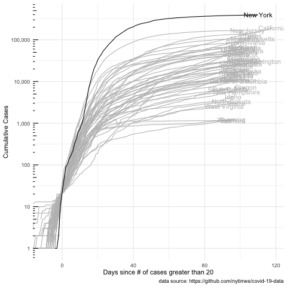

```{r setup, include=FALSE}
knitr::opts_chunk$set(warning = FALSE, message = FALSE)
```

Load libraries and set theme.
```{r}
library(tidyverse)
library(lubridate)
library(gganimate)
library(knitr)
library(geofacet)

theme_set(theme_minimal())
```

The data come from the New York Times covid-19 data [github repo](https://github.com/nytimes/covid-19-data).

```{r}
covid19 <- read_csv("https://raw.githubusercontent.com/nytimes/covid-19-data/master/us-states.csv")
```

Create a variable for days since the number of cases was over 20. Also create some summarized data that will be used later.
```{r}
covid19_comp_date <- covid19 %>% 
  group_by(state) %>% 
  arrange(date) %>% 
  mutate(cases_over20 = cases > 20,
         min_cases_over20 = which.max(cases_over20),
         days_since_over20 = row_number() - min_cases_over20) %>% 
  ungroup() %>% 
  mutate(state_ordered = fct_reorder2(state,
                                      date,
                                      cases))

#covid19_comp_date

max_days <- max(covid19_comp_date$days_since_over20)
for_labels <- covid19_comp_date %>% 
  group_by(state_ordered) %>% 
  summarize(max_case = max(cases),
            max_days_since20 = max(days_since_over20))

```

```{r, eval=FALSE}
#test plots
covid19_comp_date %>% 
  ggplot(aes(x = days_since_over20, y = cases, group = state_ordered)) +
  geom_line() + 
  coord_cartesian(xlim = c(-10, max_days)) +
  geom_text(aes(x = max_days_since20, 
                y = max_case, 
                label = state_ordered),
            color = "gray",
            data = for_labels) +
  scale_y_log10() +
#  facet_geo(~ state_ordered) #returns an error
  facet_wrap(~ state_ordered)
```


Create a `gganimate` plot that shows the number of cases over time for each state. 

```{r}
covid19_anim <- covid19_comp_date %>% 
  ggplot(aes(x = days_since_over20, y = cases, 
             group = state_ordered)) +
  geom_line() + 
  coord_cartesian(xlim = c(-10, max_days)) +
  geom_text(aes(x = max_days_since20, 
                y = max_case, 
                label = state_ordered),
            data = for_labels) +
   scale_y_log10(breaks = scales::trans_breaks("log10",
                                               function(x) 10^x),
                 labels = scales::comma) + 
  annotation_logticks(sides = "l") +
  labs(title = 'State/Territory: {closest_state}', 
       x = "Days since # of cases greater than 20", 
       y = "Cumulative Cases",
       caption = "data source: https://github.com/nytimes/covid-19-data") +
  transition_states(states = state_ordered, 
                    transition_length = 1,
                    state_length = 5) +
  shadow_mark(color = "gray", future = TRUE)
```

Create the animation (this takes a bit of time to run). Use code chunk option `eval=FALSE` so this isn't evaluated when the file is knit. 

```{r, eval=FALSE}
animate(covid19_anim, nframes = 100, duration = 30)
```

Save the animation.
```{r, eval=FALSE}
anim_save("covid19_us.gif")
```

Reload the animation so we can see it here. 
```{r}

```

Add an animation that shows counts by state over time. First, do some cleaning of the data and add static plot.

```{r}
covid_data_for_barplot <- covid19_comp_date %>% 
  ungroup() %>% 
  filter(date >= mdy("03/05/2020")) %>% 
  group_by(date) %>% 
  mutate(rank = row_number(desc(cases))) %>% 
  arrange(date, rank) %>% 
  ungroup() %>% 
  filter(rank <= 10)

static_plot <- covid_data_for_barplot %>% 
  ggplot(aes(x = rank, group = state, 
             fill = as.factor(state), 
             color = as.factor(state))) +
  geom_tile(aes(y = cases/2,
                height = cases,
                width = 0.9), alpha = 0.8, color = NA) +
  geom_text(aes(y = 0, label = paste(state, " ")), 
            vjust = 0.2, hjust = 1) +
  geom_text(aes(y = cases, label = as.character(cases), hjust=0)) +
  coord_flip(clip = "off", expand = FALSE) +
  scale_y_continuous(labels = scales::comma) +
  scale_x_reverse() +
  scale_color_viridis_d() +
  scale_fill_viridis_d() +
  guides(color = FALSE, fill = FALSE)+
  theme(axis.line=element_blank(),
        axis.text.x=element_blank(),
        axis.text.y=element_blank(),
        axis.ticks=element_blank(),
        axis.title.x=element_blank(),
         axis.title.y=element_blank(),
        legend.position="none",
        panel.background=element_blank(),
        panel.border=element_blank(),
        panel.grid.major=element_blank(),
        panel.grid.minor=element_blank(),
        panel.grid.major.x = element_line( size=.1, color="grey" ),
        panel.grid.minor.x = element_line( size=.1, color="grey" ),
        plot.title = element_text(face = 'bold', size = 16),
        plot.subtitle = element_text(size = 14),
        plot.caption =element_text(size=10, face="italic", color="grey"),
        plot.background=element_blank(),
       plot.margin = margin(2,2, 2, 4, "cm"))
```


Animation
```{r, eval=FALSE}
covid_bar_anim <-
  static_plot + 
  transition_states(date, 
                    transition_length = 4, 
                    state_length = 3)  +
  ease_aes('cubic-in-out') +
  view_follow(fixed_x = TRUE)  +
  labs(title = 'Date : {closest_state}',  
       subtitle  =  "Count of Covid-19 cases, top 10 states ",
       caption = "data source: https://github.com/nytimes/covid-19-data")

animate(covid_bar_anim, nframes = 200, duration = 30)
```

Save the animation.
```{r, eval=FALSE}
anim_save("covid_us_barplot.gif")
```

Reload the animation so we can see it here. 
```{r}

```


