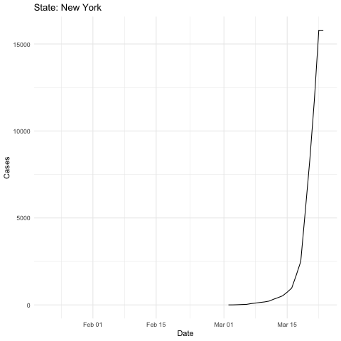

Load libraries and set theme.

```r
library(tidyverse)
library(lubridate)
library(gganimate)
library(knitr)
theme_set(theme_minimal())
```

The data are from this [github repo](https://github.com/CSSEGISandData/COVID-19/tree/master/csse_covid_19_data/csse_covid_19_time_series). But also see the main page [here](https://github.com/CSSEGISandData/COVID-19). 


Read in the data and create a state abbreviation to full state name crosswalk. The data from github are updated daily.


```r
covid <- read_csv("https://raw.githubusercontent.com/CSSEGISandData/COVID-19/master/csse_covid_19_data/csse_covid_19_time_series/time_series_19-covid-Confirmed.csv")

states <- tibble(state = c(state.name, "District of Columbia"),
                 state_abb = c(state.abb, "D.C."))
```


Filter to data in the US and make a long dataset with `date` and `cases` as columns. Before 03/10/2020, data was collected at the county level but starting on 03/10/202, it was collected at the state level. So, those date ranges are summarized separately and then all the data are recombined. Remove `Diamond Princess` and `Grand Princess` cases.


```r
covid_long <- covid %>% 
  filter(`Country/Region` == "US") %>% 
  pivot_longer(cols = 5:ncol(covid), names_to = "date", values_to = "cases") %>% 
  select(-`Country/Region`) %>% 
  mutate(date = mdy(date)) %>% 
  separate(`Province/State`, sep = ",", into = c("state", "state_abb")) %>% 
  filter(cases > 0) 

covid_long_early <-
  covid_long %>% 
  filter(!is.na(state_abb), date < mdy("03/10/2020")) %>% 
  select(-state) %>% 
  mutate(state_abb = str_trim(state_abb)) %>% 
  left_join(states, by = c("state_abb"="state_abb")) %>% 
  select(-state_abb) %>% 
  select(state, everything()) %>% 
  group_by(state, date) %>% 
  summarize(cases = sum(cases)) %>% 
  ungroup()

covid_long_late <-
  covid_long %>% 
  filter(is.na(state_abb) | date >= mdy("03/10/2020")) %>% 
  select(state, date, cases)

covid_long_all <- covid_long_early %>% 
  bind_rows(covid_long_late) %>% 
  filter(!state %in% c("Diamond Princess", "Grand Princess")) %>%  
  mutate(state_ordered = fct_rev(fct_reorder(as.factor(state), cases, max))) %>% 
  arrange(state, date)
```


Create a `gganimate` plot that shows the number of cases over time for each state. 


```r
covid_anim <- covid_long_all %>% 
  ggplot(aes(x = date, y = cases, group = state_ordered)) +
  geom_line() + 
  labs(title = 'State: {closest_state}', x = "Date", y = "Cases") +
  transition_states(states = state_ordered, 
                    transition_length = 1,
                    state_length = 5) +
  shadow_trail(color = "gray")
```

Create the animation (this takes a bit of time to run). Use code chunk option `eval=FALSE` so this isn't evaluated when the file is knit. 


```r
animate(covid_anim, nframes = 100, duration = 30)
```

Save the animation.

```r
anim_save("covid_us.gif")
```


Reload the animation so we can see it here. 

```r

```

<!-- -->


